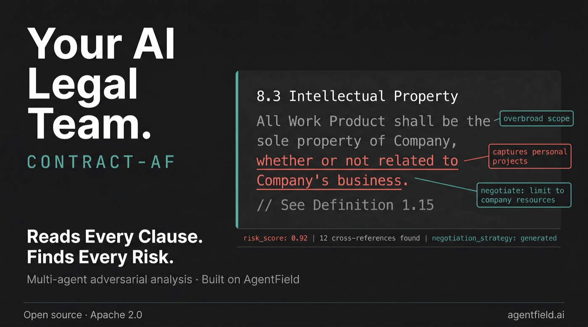

<div align="center">

# Contract-AF

### AI-Native Legal Contract Risk Analyzer Built on [AgentField](https://github.com/Agent-Field/agentfield)

[](LICENSE)
[](https://www.python.org/downloads/)
[](#development)
[](https://github.com/Agent-Field/agentfield)
[](https://github.com/Agent-Field)

<p>
  <a href="#what-you-get-back">Output</a> •
  <a href="#how-it-works">How It Works</a> •
  <a href="#quick-start">Quick Start</a> •
  <a href="#api">API</a> •
  <a href="#comparison">Comparison</a>
</p>

</div>

<p align="center">
  
</p>

Other tools flag patterns. Contract-AF **reads like a lawyer**: it navigates the full document, traces definitions across sections, discovers combination risks between clauses, and reviews from the opposing party's perspective. Every finding ships with an exploitation scenario, a risk score, and a negotiation playbook. One API call, ~$0.40-$1.30 in LLM costs.

## What You Get Back

Upload a contract, get back four deliverables:

```jsonc
{
  // 1. Risk-ranked findings with exploitation scenarios
  "findings": [
    {
      "clause_ref": "8.3",
      "clause_text": "All Work Product shall be the sole property of Company.",
      "category": "ip_work_product",
      "severity": "critical",
      "risk_score": 0.92,
      "description": "Overbroad IP assignment — captures inventions unrelated to Company's business",
      "reasoning": "Definition of 'Work Product' (Section 1.15) includes 'whether or not related to Company's business'. Combined with Section 12.3's perpetual license, this eliminates all residual IP rights post-termination.",
      "exploitation_scenario": "Company could claim ownership of employee's personal side projects, open-source contributions, or prior inventions not listed in Exhibit B.",
      "remediation": "Limit to inventions conceived using Company's confidential information or resources",
      "negotiation_strategy": "Propose: 'Work Product related to Company's current or reasonably anticipated business'. Fallback: add a carve-out for personal projects outside working hours."
    }
  ],

  // 2. Executive summary
  "executive_summary": "High-risk employment agreement with 3 critical findings...",

  // 3. Full markdown risk report
  "risk_report_md": "# Contract Review Report\n\n## Critical Findings\n...",

  // 4. Negotiation playbook with priorities, fallbacks, deal-breakers
  "negotiation_playbook": "## Negotiation Playbook\n\n### Priority 1: IP Assignment..."
}
```

Every finding includes **where** the risk lives (clause reference + text), **why** it's dangerous (reasoning + exploitation scenario), **how bad** it is (deterministic risk score), and **what to do** (remediation + negotiation strategy with fallback positions). Not "this might be a problem." Contract-AF traces definitions, proves the interaction between clauses, and tells you exactly what to negotiate.

## How It Works

Contract-AF runs a **7-phase adaptive pipeline** that mirrors how a senior lawyer actually reviews a contract — but with dozens of AI agents working in parallel, each handling a narrow, well-defined task. A typical run involves **20-50+ agent invocations**; complex contracts with deep cross-referencing and coverage gaps can trigger **100+**.

The pipeline flows through: **Intake** (classify the deal) → **Anatomy** (navigate the full document, map structure) → **Planning** (route sections to specialized analysts) → **Parallel Clause Analysis** (deep-read clusters with adaptive depth) → **Review Layer** (cross-reference resolution, adversarial review, gap verification — all streaming in parallel) → **Coverage Gate** (loop back if gaps remain) → **Synthesis** (score and rank) → **Report** (multi-format output).

What makes this different from "throw a contract at an LLM and ask for risks":

### Agents that spawn agents at runtime

When a clause analyst discovers something worth investigating deeper — a broad definition, an unusual cross-reference, a clause that interacts with another — it doesn't just flag it. It uses its own reasoning to **craft a specific investigation prompt** and **spawn a new agent** at runtime to pursue it.

An IP analyst reads *"All Work Product shall be the sole property of Company"*, checks the Definitions section, and finds that "Work Product" is defined to include inventions *"whether or not related to Company's business."* It recognizes this is unusually broad, constructs a targeted prompt — *"Analyze the impact of this definition on Sections 5, 8, and 12. Does it capture personal projects?"* — and launches a Definition Impact Analyzer with exactly that prompt. The child investigates and reports back. The parent integrates the findings.

This isn't static dispatch from a fixed playbook. The investigation path emerges from what the system discovers in *your specific contract*. Different contracts trigger different deep-dives.

### Adversarial verification

The pipeline structurally separates **finding agents** from **disproving agents**. Clause analysts are incentivized to find risks. The Adversary Reviewer is incentivized to challenge them — re-reading actual clause text (not just summaries) to determine what's actually standard practice for this contract type, what's a false positive, and what the other side would argue. This tension between competing perspectives produces higher-confidence findings than asking a single model "is this risky?"

The adversary also hunts for **hidden traps** that the analysts missed — like discovering that three separate risk clauses all survive termination via the same Section 14, creating a combined post-termination obligation far worse than any individual clause suggests.

### Streaming analysis — overlap, don't batch

Downstream agents don't wait for upstream analysis to finish. The Cross-Reference Resolver and Adversary Reviewer start consuming findings from a streaming queue as clause analysts produce them. By the time the last analyst finishes, the review layer is already halfway done. When the Cross-Ref Resolver discovers a critical interaction between two clauses reported by different analysts, it can spawn a focused deep-dive immediately — while other analysts are still running.

### Adaptive depth with hard budget caps

Not every clause deserves the same scrutiny. The system operates three nested control loops:

- **Per-analyst adaptation** — each analyst follows out-of-scope references (max 3), self-escalates to deeper analysis when it finds critical signals, and exits early when sections show no risk. The investigation depth is driven by what the contract actually contains, not by a fixed setting.
- **Cross-agent deep-dives** — when the cross-reference resolver or adversary discovers a critical combination risk or hidden trap, it spawns focused sub-agents to investigate (max 3 per phase).
- **Coverage re-analysis** — after all agents complete, a coverage gate checks whether the analysis is sufficient. If sections were missed or under-analyzed, it spawns new analysts for the gaps (max 2 iterations, 3 new analysts each).

Every loop has hard caps. The system explores deeply where signal exists, moves on quickly where it doesn't, and never spirals into unbounded cost.

### Deterministic scoring — LLMs reason, code scores

Risk scores are computed by code, not by asking an LLM to guess a number. Severity weights, combination risk multipliers (1.5x when clauses interact dangerously), exploitability multipliers (1.3x when the adversary confirms an exploitation scenario), and jurisdiction discounts (California non-competes are automatically marked unenforceable) are all deterministic. The LLM's job is the part that actually requires intelligence: generating negotiation language, suggesting fallback positions, anticipating the counterparty's arguments.

### Graceful escalation

Fast classification calls include a `confident` flag. When the first few pages don't contain enough metadata to classify the contract — unusual structure, exhibits before recitals, missing headers — the system automatically escalates to a deeper document-navigating agent. This costs ~$0.05-$0.10 extra but prevents a wrong classification from propagating through the entire pipeline. Every fast gate in the system has an escalation path to a deeper analysis when the input doesn't fit assumptions.

> **Same pattern, code security:** [SEC-AF](https://github.com/Agent-Field/sec-af) applies adversarial verification to codebases — hunters find vulnerabilities, provers disprove false positives. Every finding ships with a verdict.

## Cost

| Contract Size | Budget Models | Mid-Tier Models | Premium Models |
|---|---|---|---|
| 20-page SaaS agreement | ~$0.20-$0.45 | ~$0.65-$1.30 | ~$2.00-$4.00 |
| 50-page enterprise license | ~$0.45-$0.90 | ~$1.20-$2.40 | ~$4.00-$7.00 |
| 100-page M&A agreement | ~$0.80-$1.50 | ~$2.00-$4.00 | ~$6.00-$12.00 |

Budget: Kimi K2.5, MiniMax. Mid-tier: GPT-4o-mini, Sonnet. Premium: Opus, GPT-4o. Any OpenRouter-compatible model works.

## Quick Start

```bash
pip install -e .[dev]
```

### CLI

```bash
# Analyze a contract
contract-af analyze my-contract.pdf --context "I am the customer"

# JSON output
contract-af analyze my-contract.docx --format json -o report.json

# Start the API server
contract-af serve --port 8000
```

### API

#### AgentField Control Plane

```bash
curl -X POST http://localhost:8080/api/v1/execute/async/contract-af.analyze \
  -H "Content-Type: application/json" \
  -d '{"input": {"file_path": "/path/to/contract.pdf", "user_context": "I am the customer"}}'
```

#### Standalone API

```bash
# Upload and start analysis
curl -X POST http://localhost:8000/analyze \
  -F "file=@my-contract.pdf" \
  -F "user_context=I am the customer, SaaS subscription"

# Response: {"job_id": "abc-123", "status": "running"}

# Poll for results
curl http://localhost:8000/analyze/abc-123

# Get markdown report
curl http://localhost:8000/analyze/abc-123/report
```

<details>
<summary><strong>API endpoints</strong></summary>

| Endpoint | Method | Description |
|---|---|---|
| `/health` | GET | Liveness probe |
| `/analyze` | POST | Upload contract file (PDF, DOCX, TXT) + optional `user_context`. Returns `job_id` |
| `/analyze/{job_id}` | GET | Poll analysis status and results |
| `/analyze/{job_id}/report` | GET | Get markdown risk report for completed job |

**Supported formats:** `.pdf`, `.docx`, `.doc`, `.txt`, `.md`

</details>

## Comparison

| | Contract-AF | Harvey AI | Klarity | Spellbook |
|---|---|---|---|---|
| **Approach** | Multi-agent pipeline with adversarial verification | Single model, enterprise | ML extraction + rules | Single model, clause library |
| **Verified findings** | Adversarial review + exploitation scenarios | Not documented | Pattern-based extraction | Not documented |
| **Negotiation playbook** | Per-finding strategy with fallbacks | General guidance | Not included | Clause suggestions |
| **Cross-clause analysis** | Streaming cross-reference resolution with runtime deep-dives | Not documented | Not documented | Not documented |
| **Adaptive depth** | 3 nested control loops with budget caps | Fixed pass | Fixed pass | Fixed pass |
| **Open source** | Apache 2.0 | Proprietary | Proprietary | Proprietary |
| **Cost** | ~$0.40-$1.30/contract | ~$500-$2000/mo | ~$1000+/mo | ~$500+/mo |

**Where Contract-AF is strongest**: Adversarial verification, cross-clause interaction analysis, adaptive depth, deterministic scoring, negotiation playbooks, and cost.

**Where others are stronger**: Harvey and Spellbook have enterprise integrations, clause libraries, and years of training on legal corpora. Klarity has purpose-built ML extraction for specific contract types. Contract-AF is newer and focused on depth of analysis over breadth of integrations.

## Supported Contract Types

SaaS agreements, employment contracts, NDAs, licensing agreements, service agreements, consulting agreements, partnership agreements — and any contract type you throw at it. The system identifies the contract type at intake, selects relevant clause categories, and checks for expected clauses based on that classification. No code changes needed to support new types.

## Development

```bash
python -m venv .venv && source .venv/bin/activate
pip install -e .[dev]
pytest                    # 179 tests
ruff check src/ tests/
```

---

### Also built on AgentField

> **[SEC-AF](https://github.com/Agent-Field/sec-af)** — AI-native security auditor. 250 agents per audit, 94% noise reduction, every finding proven exploitable.
>
> **[AF Deep Research](https://github.com/Agent-Field/af-deep-research)** — Autonomous research backend. 10,000+ agent invocations per query with self-correcting loops.

[All repos →](https://github.com/Agent-Field)

---

<div align="center">

Contract-AF is built on [AgentField](https://github.com/Agent-Field/agentfield), open infrastructure for production-grade autonomous agents. [See what else we're building →](https://github.com/Agent-Field)

**[Apache-2.0](LICENSE)**

</div>
