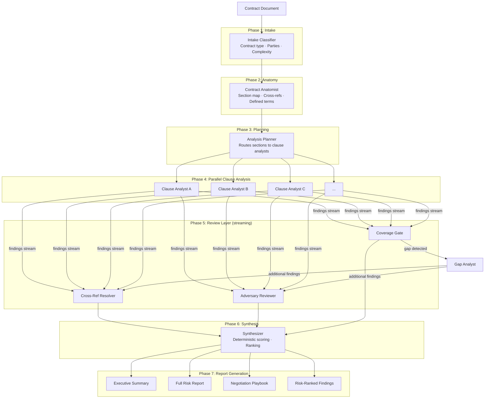

# Contract-AF Architecture

Contract-AF is a multi-agent legal contract risk analyzer built on [AgentField](https://agentfield.dev). It uses a 7-phase adaptive pipeline that invokes 20-50+ specialized agents per contract, where agents spawn other agents at runtime based on what they discover. Adversarial verification separates finding agents from disproving agents, and a streaming pipeline overlaps work across phases so downstream analysis starts before upstream work finishes.

This document explains how the system works for developers who want to understand the design, contribute, or adapt the patterns for their own use.

---

## Overview

Most contract analysis tools apply a fixed set of rules or run a single LLM pass over the document. Contract-AF takes a different approach: it builds a composite reasoning system from specialized, constrained agents that each do one thing well.

The key insight is that legal risk analysis mirrors how a skilled attorney actually works. They don't read a contract once and produce a report. They read the structure first, identify which sections need deep attention, follow cross-references, challenge their own findings, and verify coverage before concluding. Contract-AF encodes this process as an agent pipeline.

**What makes it different:**

- **Adaptive depth.** Agents decide how deep to go based on what they find. A routine indemnification clause gets standard analysis; a clause with unusual carve-outs triggers deeper investigation.
- **Adversarial verification.** Separate agents find risks and challenge them. This dramatically reduces false positives compared to single-model approaches.
- **Deterministic scoring.** LLMs reason about risks; code computes scores. Severity weights, combination multipliers, and jurisdiction discounts are applied by the scoring engine, not by asking an LLM to "rate this 1-10."
- **Streaming pipeline.** Cross-reference resolution and adversarial review start while clause analysts are still running.

---

## Pipeline Phases

The pipeline runs in 7 phases. Phases 1-3 are sequential (each builds on the previous). Phases 4-6 overlap via streaming. Phase 7 runs after all findings are finalized.



### Phase 1: Intake

The intake classifier reads the contract and determines: what type of contract is this, who are the parties, and how complex is it? This classification drives everything downstream — which clause analysts to use, which risk patterns to look for, which jurisdiction rules apply.

Classification uses a fast path for clear-cut cases. When the input is ambiguous or unusually structured, the system automatically escalates to a deeper analysis pass rather than propagating a wrong classification through the rest of the pipeline.

### Phase 2: Anatomy

The contract anatomist navigates the full document and builds a structural map: which sections exist, what they cover, how they reference each other, and which terms are defined where. This map is the shared context that all downstream agents work from.

Cross-reference tracing is particularly important. A liability cap in Section 8 might be modified by an exception in Section 14's survival clause. The anatomist surfaces these connections so clause analysts don't miss them.

### Phase 3: Planning

The analysis planner takes the section map and contract type, then decides how to route sections to clause analysts. It groups related sections into clusters (e.g., all IP-related clauses together), determines how many parallel analysts to run, and assigns each analyst its cluster with relevant context.

This routing is adaptive. A 20-page SaaS agreement might get 4 analysts; a 100-page M&A agreement might get 12.

### Phase 4: Parallel Clause Analysis

Multiple clause analysts run in parallel, each handling a cluster of related sections. This is where most of the analytical work happens.

Each analyst can:
- **Follow cross-references** (up to 3 hops) when a clause points to another section that's relevant to understanding the risk
- **Self-escalate** to deeper analysis when it detects a critical signal (unusual carve-outs, broad definitions, asymmetric obligations)
- **Spawn child agents** with runtime-crafted prompts for specific sub-investigations (e.g., "analyze how this definition of 'Confidential Information' interacts with the IP assignment clause")

The child agent spawning is key. The parent analyst doesn't follow a fixed playbook — it reasons about what it found and crafts a targeted investigation prompt for the child. The investigation path emerges from the content.

### Phase 5: Review Layer

Three agents run in parallel, consuming findings from a streaming queue as clause analysts produce them:

**Cross-Reference Resolver** tracks interactions between findings from different analysts. If Analyst A flags a broad indemnification clause and Analyst B flags an unlimited liability exposure, the resolver identifies that these two findings combine into a higher-risk scenario than either represents alone.

**Adversary Reviewer** challenges findings. It's explicitly incentivized to find false positives, identify where findings are overstated, and hunt for risks that the clause analysts missed entirely (hidden traps that don't look risky in isolation). This adversarial tension is what separates the system from single-pass analysis.

**Coverage Gate** checks whether the analysis covers the full document. If it detects sections that weren't adequately analyzed, it spawns gap analysts (up to 2 iterations) to fill the holes. After gap analysis, the new findings flow back into the cross-ref resolver and adversary.

### Phase 6: Synthesis

The synthesizer collects all findings — from clause analysts, gap analysts, cross-ref resolver, and adversary — and applies deterministic scoring. No LLM guessing at scores. The scoring engine applies severity weights, combination multipliers, exploitability multipliers, and jurisdiction discounts using code. See the [Scoring System](#scoring-system) section for details.

Output is a ranked list of findings ordered by composite risk score.

### Phase 7: Report Generation

The report writer produces four deliverables from the scored findings:

- **Risk-ranked findings** — machine-readable JSON with all findings, scores, clause references, and remediation suggestions
- **Executive summary** — 1-2 page overview for non-lawyers, highlighting the top risks and recommended actions
- **Full risk report** — detailed analysis with clause-level citations, reasoning, and remediation language
- **Negotiation playbook** — specific asks organized by priority: must-fix, should-fix, nice-to-have

---

## Agent Inventory

All agents live in `src/contract_af/agents/`.

| Agent | File | Role | Input | Output |
|---|---|---|---|---|
| Intake Classifier | `intake.py` | Classifies contract type, parties, complexity | Raw document | Contract classification with confidence flag |
| Contract Anatomist | `anatomy.py` | Maps document structure, sections, cross-refs | Full document | Section map, defined terms, cross-references |
| Analysis Planner | `planner.py` | Routes sections to clause analysts | Section map + contract type | Analysis plan with analyst assignments |
| Clause Analyst | `clause_analyst.py` | Deep-reads section clusters, finds risks | Section cluster + context | Findings with clause refs, reasoning, remediation |
| Gap Analyst | `gap_analyst.py` | Analyzes sections missed in initial pass | Gap sections + existing findings | Additional findings for coverage gaps |
| Cross-Ref Resolver | `cross_ref.py` | Resolves interactions between findings | Streaming findings queue | Combination risks, interaction effects |
| Adversary Reviewer | `adversary.py` | Challenges findings, hunts hidden traps | Streaming findings queue | False positives, exploitation scenarios, hidden traps |
| Coverage Gate | `coverage.py` | Checks analysis completeness | All findings + section map | Coverage assessment, gap identification |
| Synthesizer | `synthesizer.py` | Scores and ranks findings deterministically | All findings + adversary results | Scored, ranked findings |
| Report Writer | `report_writer.py` | Generates final deliverables | Scored findings + metadata | Executive summary, risk report, negotiation playbook |

---

## Key Design Patterns

### Meta-Prompting: Agents Spawning Agents

The most powerful pattern in the system is that parent agents craft specific investigation prompts for child agents at runtime. This is not static dispatch — the parent reasons about what it found and decides what to investigate next.

Example: An IP clause analyst reads a software license agreement and notices the definition of "Intellectual Property" is unusually broad, potentially capturing work done before the contract. Rather than flagging this as a generic "broad IP definition" finding, it spawns a Definition Impact Analyzer with a targeted prompt:

> "Analyze how the definition of 'Intellectual Property' in Section 1.4 — which includes 'all inventions, whether or not patentable, conceived or reduced to practice during the Term' — interacts with the IP assignment obligations in Section 7.2 and the carve-out for pre-existing IP in Exhibit B. Determine whether the carve-out is sufficient to protect work predating the agreement."

The child agent reads exactly those sections and returns a focused finding. The parent integrates it into its output.

This means the investigation path emerges from the content of the contract, not from a fixed checklist. Unusual contracts get unusual investigations.

**Budget control:** Child agent spawning has hard caps (configurable in `config.py`). A clause analyst can spawn at most N child agents, and each child is bounded in scope. Without caps, adaptive systems become unbounded cost sinks.

### Adversarial Tension: HUNT then PROVE

Finding agents and challenging agents are separate, with different incentives.

Clause analysts are optimized to find risks. They're prompted to flag anything that could be problematic, err on the side of inclusion, and surface issues even when uncertain. This maximizes recall.

The adversary reviewer is optimized to disprove findings. It's prompted to identify where findings are overstated, where the risk is theoretical rather than practical, where standard market terms are being flagged as unusual, and where the real risk is something the analysts missed entirely.

The result: findings that survive adversarial review are much more likely to be genuine risks. The adversary's output feeds directly into the scoring engine — confirmed exploitation scenarios get a 1.3x score multiplier; findings the adversary successfully challenges get downweighted.

This pattern is borrowed from red team / blue team security practices and applied to legal analysis.

### Streaming Pipeline

In a naive pipeline, Phase 5 (review layer) would wait for all of Phase 4 (clause analysis) to finish before starting. For a 100-page contract with 12 parallel analysts, that's a lot of idle time.

Instead, clause analysts emit findings to a shared queue as they complete each section. The cross-ref resolver and adversary reviewer start consuming from that queue immediately. By the time the last clause analyst finishes, the review layer has already processed most of the findings.

This overlapping work has a secondary benefit: the cross-ref resolver can catch interaction effects between findings from different analysts while both analysts are still running. If Analyst A's finding about indemnification and Analyst B's finding about liability caps interact dangerously, the resolver flags this combination risk in real time rather than in a post-processing pass.

```
Time →

Analyst A:  [============================]
Analyst B:      [========================]
Analyst C:          [====================]

Cross-Ref:          [========================]  (starts when first findings arrive)
Adversary:          [========================]  (starts when first findings arrive)
Coverage:                               [====]  (checks after most findings in)
```

### Three Nested Control Loops

The system has three levels of adaptive behavior, each with its own budget cap:

**Inner loop (per-analyst):** Each clause analyst decides how deep to go on its assigned sections. It can follow cross-references (up to 3 hops), self-escalate to deeper analysis on critical signals, and spawn child agents for sub-investigations. The inner loop is bounded by per-analyst limits in `config.py`.

**Middle loop (cross-agent):** The cross-ref resolver and adversary reviewer can trigger deeper investigation when they discover combination risks or hidden interactions. This spawns targeted deep-dive agents that read specific section combinations. The middle loop is bounded by a maximum number of deep-dive spawns per pipeline run.

**Outer loop (pipeline-level):** The coverage gate checks whether the full document was analyzed. If it finds gaps, it spawns gap analysts and runs another coverage check. This loop runs at most 2 iterations before the pipeline proceeds to synthesis regardless.

The nesting means the system can adapt at multiple granularities without any single level running away. A contract with one unusually complex clause gets deep inner-loop analysis on that clause without triggering outer-loop re-analysis of the whole document.

### Graceful Escalation

The intake classifier uses a fast path for clear-cut cases: standard SaaS agreement, obvious parties, straightforward structure. This is cheap and fast.

But real contracts don't always cooperate. Unusual structures, embedded exhibits, non-standard formats, or ambiguous contract types can cause the fast path to produce a low-confidence classification.

When this happens, the system automatically escalates to a deeper analysis pass. The deeper pass navigates the full document, reads definitions, traces structure, and produces a confident classification before the rest of the pipeline starts.

This prevents wrong classifications from propagating. A contract misclassified as a "service agreement" when it's actually an "IP assignment" would route to the wrong clause analysts and miss the most important risks. The confidence flag and escalation path ensure this doesn't happen silently.

---

## Scoring System

Scoring is deterministic. The synthesizer applies a formula in `scoring.py` — no LLM is asked to assign scores.

**Base severity weights:**

| Severity | Weight |
|---|---|
| Critical | 1.0 |
| High | 0.8 |
| Medium | 0.5 |
| Low | 0.2 |

**Multipliers applied on top of base weight:**

- **Combination risk (1.5x):** Applied when the cross-ref resolver identifies that two or more findings interact dangerously. A high-severity indemnification clause combined with an unlimited liability exposure becomes 1.5x more severe than either alone.
- **Exploitability (1.3x):** Applied when the adversary reviewer confirms a specific exploitation scenario — not just a theoretical risk but a concrete way the clause could be used against the signing party.

**Jurisdiction discounts:**

Some risks are unenforceable in specific jurisdictions regardless of how the contract is written. California non-compete clauses, for example, are broadly unenforceable under California Business and Professions Code § 16600. The scoring engine applies jurisdiction-specific discounts to findings that fall into these categories, rather than flagging them as high-severity risks that the signing party needs to negotiate away.

Jurisdiction rules are configured in `config.py` and applied by the scoring engine, not inferred by LLMs.

**Why deterministic scoring matters:**

LLMs are inconsistent at numerical scoring. Ask the same model to rate the same risk twice and you'll get different numbers. Deterministic scoring means the same findings always produce the same scores, the scoring logic is auditable, and you can tune weights without rerunning the full pipeline.

---

## Cost Estimates

Cost depends on contract length and model selection. These estimates assume typical contracts with standard complexity.

| Contract Size | Budget Models | Mid-Tier Models | Premium Models |
|---|---|---|---|
| 20-page SaaS agreement | ~$0.20-$0.45 | ~$0.65-$1.30 | ~$2.00-$4.00 |
| 50-page enterprise license | ~$0.45-$0.90 | ~$1.20-$2.40 | ~$4.00-$7.00 |
| 100-page M&A agreement | ~$0.80-$1.50 | ~$2.00-$4.00 | ~$6.00-$12.00 |

Cost scales with contract length (more sections = more analysts) and complexity (more cross-references = more resolver work). The budget caps in `config.py` prevent runaway costs on unusually complex contracts.

Model selection is configured per-agent. You can run intake and anatomy on budget models (they're doing classification and extraction, not deep reasoning) and reserve premium models for clause analysts and the adversary reviewer (where reasoning quality matters most).

---

## Source Code Layout

```
src/contract_af/
├── app.py              # FastAPI application, /analyze endpoint, job management
├── config.py           # Configuration: model selection, budget caps, loop limits
├── scoring.py          # Deterministic risk scoring engine
├── agents/             # All agent implementations
│   ├── intake.py       # Contract classification
│   ├── anatomy.py      # Document structure mapping
│   ├── planner.py      # Analysis planning and routing
│   ├── clause_analyst.py # Deep clause analysis with meta-prompting
│   ├── gap_analyst.py  # Coverage gap analysis
│   ├── cross_ref.py    # Cross-reference resolution
│   ├── adversary.py    # Adversarial review
│   ├── coverage.py     # Coverage gate
│   ├── synthesizer.py  # Finding synthesis and ranking
│   └── report_writer.py # Report generation
├── models/
│   └── types.py        # Pydantic models for all data structures
└── reasoners/
    ├── harnesses.py    # Agent definitions (AgentField integration)
    └── phases.py       # Pipeline phase orchestration
```

**`app.py`** handles the HTTP layer. The `/analyze` endpoint accepts a contract document, starts a pipeline run, and returns a job ID. Clients poll `/jobs/{id}` for status and results. Streaming endpoints expose findings as they arrive for real-time UIs.

**`config.py`** is where you tune the system. Model assignments per agent, budget caps per loop level, maximum reference follows, maximum child agent spawns, maximum coverage iterations, jurisdiction rules. Most behavioral changes start here.

**`scoring.py`** is the deterministic scoring engine. It's intentionally separate from the agents so the scoring logic can be tested, audited, and modified without touching agent code.

**`reasoners/phases.py`** orchestrates the pipeline phases. It manages the streaming queue between Phase 4 and Phase 5, coordinates parallel execution, and handles the coverage gate's re-analysis loop.

**`models/types.py`** defines the Pydantic models that flow between agents. Every agent's input and output is typed. This makes the data flow explicit and catches integration errors at startup rather than at runtime.

---

## Contributing

The most impactful areas for contribution:

**New clause analysts.** The planner routes sections to analysts by contract type and section content. Adding a specialized analyst for a new contract type (employment agreements, real estate leases, franchise agreements) means adding an agent file and updating the planner's routing logic.

**Jurisdiction rules.** The scoring engine's jurisdiction discounts are configured in `config.py`. Adding rules for new jurisdictions or updating existing ones doesn't require touching agent code.

**Scoring weights.** If you have domain expertise suggesting the combination risk multiplier should be 1.8x rather than 1.5x, or that medium-severity findings are underweighted, `scoring.py` is the place to make that change.

**Report templates.** The report writer generates deliverables from scored findings. The templates are in `agents/report_writer.py` and can be adapted for different output formats (HTML, PDF, custom JSON schemas).

When adding a new agent, follow the pattern in existing agents: typed input/output models in `types.py`, agent implementation in `agents/`, registration in `reasoners/harnesses.py`, and integration into the appropriate phase in `reasoners/phases.py`.
