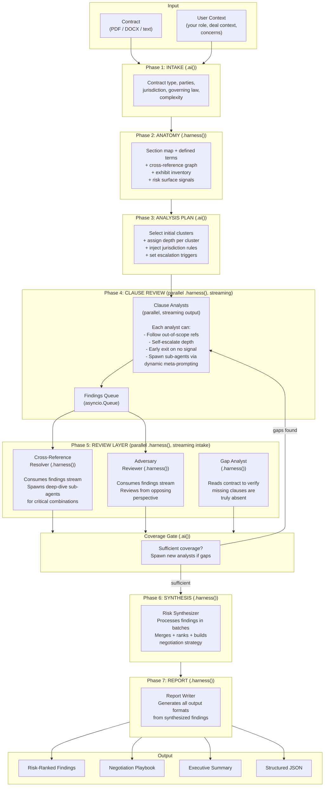
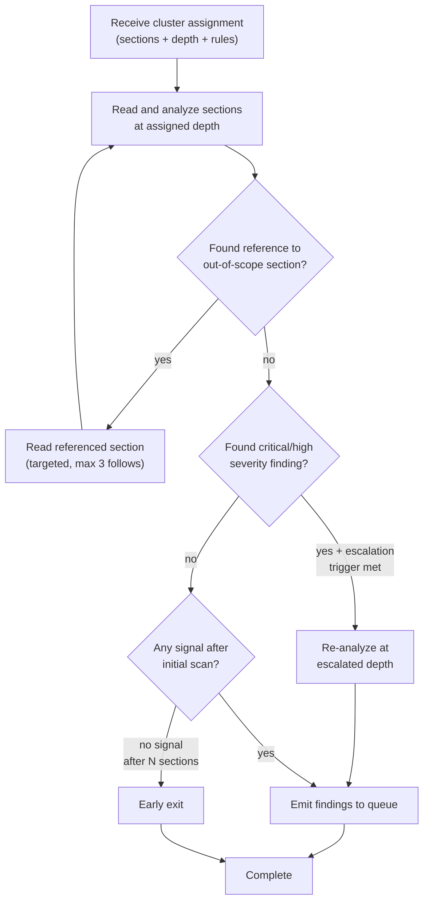
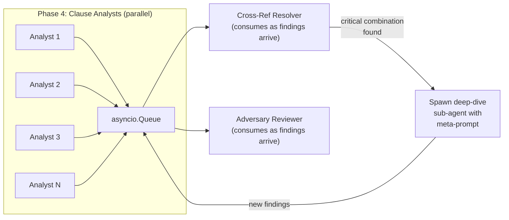
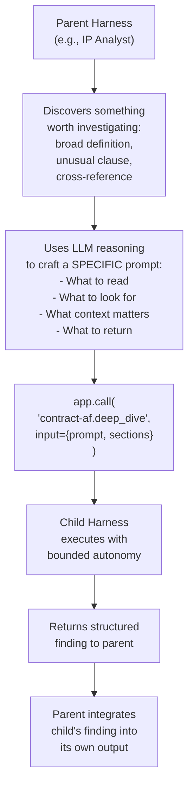
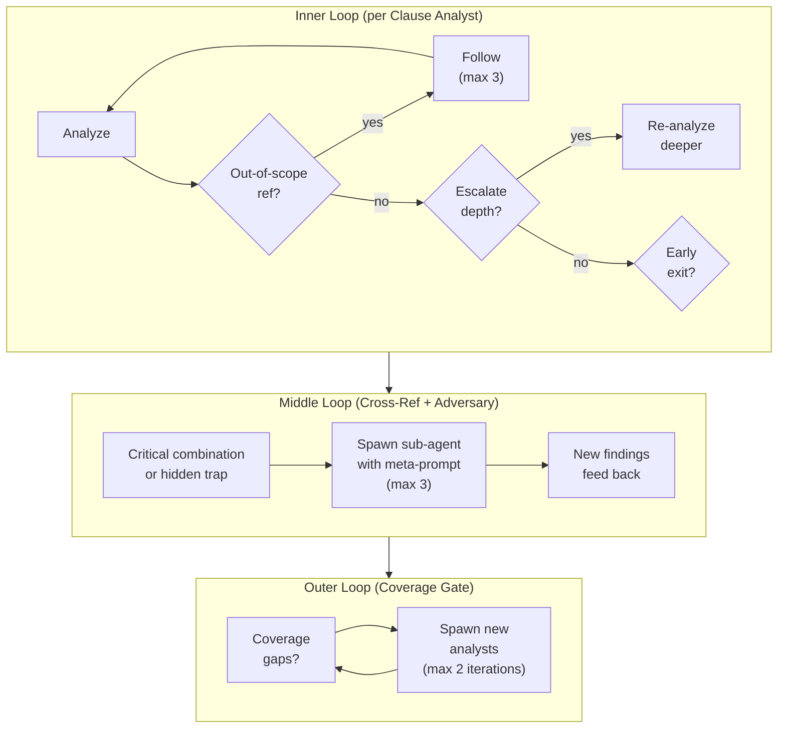

# Contract-AF: Architecture Design

## Foundational Philosophy

From [The Atomic Unit of Intelligence](https://www.santoshkumarradha.com/writing/atomic-unit-of-intelligence): The atomic unit is no longer a single LLM call — it's a **harness**: stateful, agentic, opaque. Orchestrators give harnesses goals and verify outcomes; they don't control each step. More capable units are less predictable in execution, requiring **outcome verification** rather than process control.

From the [Multi-Reasoner Archei Rules](../../multi-reasoner-archei-rules.md): Each LLM call should produce a flat schema (2-4 attributes). If output drives programmatic decisions → structured JSON. If output becomes context for another LLM → string. The value is in intelligence — don't replicate what can be done programmatically.

**Contract-AF applies both:** Harnesses (`.harness()`) are the workhorses — they read, navigate, reason, and spawn sub-agents dynamically. Fast AI calls (`.ai()`) are ONLY used where the entire input fits comfortably in a single context window AND the output is a simple routing/classification decision. When `.ai()` fails due to input complexity, the system gracefully escalates to `.harness()` (see `.ai()` Fallback Pattern below).

For the full multi-reasoner architecture guide, see [Multi-Reasoner Architecture](../../multi-reasoner-architecture.md).

---

## `.harness()` vs `.ai()` Decision Framework

```
Does this agent need to...

├─ Read/navigate a document?                    → .harness()
├─ Process more than ~3,000 tokens of input?    → .harness()
├─ Make multi-turn decisions (read X, then Y)?  → .harness()
├─ Spawn sub-agents with dynamic prompts?       → .harness()
├─ Produce output > 4 fields?                   → .harness()
│
└─ ALL of these are false?
   ├─ Fast classification (< 500 tokens in/out)? → .ai()
   ├─ Simple routing decision (enum output)?      → .ai()
   └─ Otherwise                                   → .harness()
```

**The rule:** When in doubt, use `.harness()`. The `.ai()` is reserved for gates, classifiers, and routing decisions where the input is small and the output is a flat enum/schema.

---

## How a Real Contract Review Works

A real lawyer doesn't follow a rigid checklist — they adapt as they read:

```
1. Intake        → Understand the deal
2. Anatomy       → Map the structure
3. Analysis Plan → Decide what to scrutinize (initial plan)
4. Clause Review → Deep read, but ADAPT as you go:
                    - "This clause references something I need to check"
                    - "This is more complex than I expected, go deeper"
                    - "I found a new risk category, should I look for more?"
5. Cross-Check   → Resolve dependencies, find combinations
6. Gap Analysis  → What's missing?
7. Adversary     → What does the other side see?
8. Strategy      → What to negotiate
9. Report        → Client memo
```

---

## Architecture: Adaptive Review Pipeline



---

## Phase Details

### Phase 1: INTAKE

**Type:** `.ai()` — this is one of only TWO `.ai()` calls in the pipeline.

The input is small (first 2-3 pages), the output is a flat classification. This is a pure routing gate. If you are not able to find these details then we should launch a harness to find it because it may potentially not be in the first part as well but it is good to start with AI. 

```python
class IntakeResult(BaseModel):
    contract_type: str       # "saas_agreement" | "employment" | "nda" | "safe" | ...
    parties: list[Party]     # [{name, role, entity_type}]
    your_role: str           # who you are in this contract
    jurisdiction: str        # "California, USA" | "England & Wales" | ...
    governing_law: str
    deal_structure: str      # one-line summary
    complexity: str          # "simple" | "standard" | "complex"
```

**Why `.ai()` is correct here:** Input is ~500-1000 tokens (first pages only). Output is 7 flat fields. No document navigation needed. Pure classification.

**`.ai()` Fallback Pattern:** Real contracts don't always have clean first pages. If the intake `.ai()` can't confidently classify (e.g., key metadata isn't on pages 1-3, unusual structure, embedded exhibits before the recitals), it reports `confident: false` and the system escalates to a `.harness()` that navigates the full document.

```python
class IntakeResult(BaseModel):
    contract_type: str
    parties: list[Party]
    your_role: str
    jurisdiction: str
    governing_law: str
    deal_structure: str
    complexity: str
    confident: bool  # Did .ai() get enough signal from first pages?

# Try fast .ai() first
intake = await app.ai(
    prompt="Classify this contract from the first 2-3 pages.",
    input={"text": first_pages},
    schema=IntakeResult,
)

if not intake.confident:
    # Escalate: harness navigates full document to find metadata
    intake = await app.call(
        "contract-af.intake_harness",
        input={"document": full_document, "partial_intake": intake.dict()},
    )
```

The fallback harness receives the partial intake (what `.ai()` DID find) and fills in the gaps by navigating the full document. Cost: ~$0.05-$0.10 extra, but prevents a wrong classification from propagating through all downstream phases.

This pattern applies to every `.ai()` call in the pipeline:
- **Analysis Planner:** If anatomy metadata is ambiguous, escalate to a `.harness()` that re-reads the contract structure
- **Coverage Gate:** If coverage assessment can't determine sufficiency from metadata alone, escalate to a `.harness()` that reads the uncovered sections

---

### Phase 2: ANATOMY

**Type:** `.harness()` — the agent needs to navigate the full document.

The Anatomist reads the entire contract with tool access: jumps to Definitions section, scans for capitalized terms, follows "as defined in Section X" references, reads exhibit headers, identifies structural complexity patterns.

```python
class AnatomyResult(BaseModel):
    sections: list[Section]           # [{number, title, page_range, subsections}]
    defined_terms: list[DefinedTerm]  # [{term, definition_text, section_ref, usage_count}]
    cross_references: list[CrossRef]  # [{from_section, to_section, relationship_type}]
    exhibits: list[Exhibit]           # [{label, title, pages, modifies_sections}]
    key_dates: list[KeyDate]          # [{date, description, section_ref}]
    risk_surface: list[RiskSignal]    # structural complexity signals for downstream depth routing
```

**Why `.harness()` is required:** A 50-page contract can't be passed as context to a single `.ai()` call. The agent needs to navigate — read section headers, jump to definitions, trace cross-references. This is multi-turn, tool-using work.

**The `risk_surface` output** feeds the Analysis Planner — sections with structural complexity signals (heavy cross-references, nested conditions, unusually long subsections, broad definitions) get assigned higher analysis depth.

---

### Phase 3: ANALYSIS PLAN

**Type:** `.ai()` — the second and LAST `.ai()` call in the pipeline.

Input is the AnatomyResult (structured, summarized — NOT the full contract text) + IntakeResult. Output is a routing plan.

```python
class ClauseCluster(BaseModel):
    name: str                    # "ip_work_product" | "liability_indemnity" | ...
    sections: list[str]          # assigned section numbers
    initial_depth: str           # "scan" | "standard" | "thorough"
    escalation_trigger: str      # "any_critical_finding" | "multiple_high" | "never"
    escalated_depth: str         # what depth to escalate to
    jurisdiction_rules: list[str]
    priority: int                # execution order hint

class AnalysisPlan(BaseModel):
    clusters: list[ClauseCluster]
    skipped_sections: list[str]        # boilerplate
    unassigned_sections: list[str]     # tracked for coverage gate
    jurisdiction_rules: list[str]
```

**Why `.ai()` is correct here:** Input is structured metadata (~1000-2000 tokens), not raw contract text. Output is a routing plan. No document navigation needed. But note: this ONLY works because the Anatomist already summarized the structure. If we tried to do intake + anatomy + planning in one `.ai()` call, it would fail on any contract longer than ~10 pages.

---

### Phase 4: CLAUSE REVIEW — Adaptive Deep Analysis

**Type:** `.harness()` per cluster, parallel, streaming output.

Each Clause Analyst is a harness that reads its assigned sections with full tool access. It navigates definitions, follows cross-references within scope, and adapts its analysis depth based on what it finds.

#### Inner Loop: Self-Adaptation



#### Meta-Prompting: How Clause Analysts Spawn Sub-Agents

This is the critical architectural pattern. When a Clause Analyst encounters something that needs deeper investigation beyond its scope, it doesn't just "flag it" — it uses its intelligence to craft a specific prompt and invoke a sub-agent.

**Example: Definition impact tracing**

The IP Analyst reads Section 8.3: "All Work Product shall be the sole property of Company."

It then checks the Definitions section and finds: "'Work Product' means any and all inventions, discoveries, improvements, and works of authorship, whether or not patentable, conceived or reduced to practice during the Term, **whether or not related to Company's business**."

The analyst recognizes this is an unusually broad definition. It crafts a targeted sub-agent call:

```python
# The harness (IP Analyst) dynamically constructs this prompt
# based on what it discovered during analysis
sub_agent_prompt = f"""
You are analyzing the impact of a broad definition in an employment agreement.

DEFINITION:
"Work Product" means any and all inventions, discoveries, improvements,
and works of authorship, whether or not patentable, conceived or reduced
to practice during the Term, whether or not related to Company's business.

TASK:
1. Read the following sections that reference "Work Product": {sections_using_term}
2. For each usage, assess: does the broad definition ("whether or not related
   to Company's business") create additional risk in that specific context?
3. In particular, check if Section {assignment_section} combined with this
   definition effectively captures the employee's personal projects.

Return findings as clause_ref, risk_description, severity.
"""

# The harness calls app.call() to spawn a sub-agent
deep_dive_result = await app.call(
    "contract-af.definition_impact_analyzer",
    input={
        "prompt": sub_agent_prompt,
        "contract_sections": relevant_sections,
        "defined_term": "Work Product",
    }
)
```

**This is the "meta-meta prompt" pattern:** The parent harness uses its intelligence to:
1. **Discover** something worth investigating (the broad definition)
2. **Craft a highly specific prompt** tailored to exactly what it found
3. **Determine which sections** the sub-agent needs to read
4. **Invoke** the sub-agent with this crafted prompt
5. **Integrate** the sub-agent's findings into its own output

The parent harness is not following a script — it's using LLM reasoning to decide what to investigate and how to frame the investigation for the child harness. The child harness then has its own bounded autonomy to read the assigned sections and reason about them.

**This is different from static dispatch.** In SEC-AF, the orchestrator statically routes to predetermined hunters. Here, the harness ITSELF is the intelligent dispatcher — it decides at runtime what sub-investigations are needed based on what it discovers.

#### Clause Analyst Output

```python
class ClauseAnalysisResult(BaseModel):
    findings: list[Finding]
    sections_analyzed: list[str]
    sections_followed: list[str]       # out-of-scope sections that were followed
    sub_agents_spawned: int            # how many deep-dives were triggered
    depth_used: str                    # actual depth (may differ from initial)
    early_exit: bool
    coverage_notes: list[str]          # "Section X needs further analysis"
```

**Inter-agent data flow (archei rules):** Findings stream to Phase 5 as **strings** (natural language descriptions with clause references), not as structured JSON — because they're consumed by other LLMs (Cross-Ref Resolver, Adversary Reviewer), not by programmatic logic. The structured schema wraps them for the queue, but the content itself is rich text.

---

### Phase 5: REVIEW LAYER — Three Parallel Harnesses

All three are `.harness()` calls. None of them can be `.ai()`.

#### 5a: Cross-Reference Resolver

**Type:** `.harness()` — must read the full contract to trace cross-clause interactions.

**Streaming consumer:** Starts processing findings as they arrive from the queue. As more findings accumulate, it checks for cross-clause interactions.

**Meta-prompting for deep-dives:** When the Cross-Ref Resolver discovers a critical combination risk, it spawns a focused sub-agent. The key: the resolver WRITES the sub-agent's prompt based on what it discovered.

```python
# Cross-Ref Resolver discovers: Section 5.1 assigns IP, Section 12.3 grants
# exclusive perpetual license. It crafts a specific investigation prompt:

deep_dive_prompt = f"""
COMBINATION RISK INVESTIGATION

Two clauses in this contract may interact to create a trap:

CLAUSE A (Section 5.1): "{clause_a_text}"
  → Assigns all IP to Company

CLAUSE B (Section 12.3): "{clause_b_text}"
  → Grants Company exclusive, perpetual, irrevocable license to all Work Product

QUESTION: Read both clauses together with the definition of "Work Product"
(Section 1.15) and "Intellectual Property" (Section 1.8).

Determine:
1. Does the combination effectively eliminate any residual IP rights for
   the Contractor, even though Section 5.1 alone appears to leave some rights?
2. Does the "perpetual, irrevocable" license in 12.3 survive termination
   per Section 14 (Survival)?
3. What is the practical impact for the Contractor?
"""

result = await app.call(
    "contract-af.combination_deep_dive",
    input={"prompt": deep_dive_prompt, "sections": ["5.1", "12.3", "1.15", "1.8", "14"]}
)
```

**Bounded:** Max 3 deep-dive spawns per run. Each deep-dive is itself a `.harness()` that reads the specified sections and returns a structured finding.

#### 5b: Adversary Reviewer

**Type:** `.harness()` — must read the full contract from the opposing perspective.

**Cannot be `.ai()`:** The adversary needs to re-read actual contract clauses (not just finding summaries) to spot hidden traps the advocates missed. A finding summary like "Section 8 has a broad non-compete" isn't enough — the adversary needs to read Section 8's actual text to spot the nuance that "the geographic scope includes 'any jurisdiction where Company does business'" which, for a global company, means worldwide.

**Streaming consumer:** Starts reviewing findings as they arrive. For each finding:
1. Reads the actual clause text (not just the finding summary)
2. Checks: "Is this actually standard for this contract type?" → false positive
3. Asks: "How would my client (Party B) USE this clause against Party A?" → exploitation scenario

**Meta-prompting for hidden trap discovery:** The adversary reviewer can also spawn sub-agents when it discovers patterns:

```python
# Adversary notices that 3 separate findings all reference Section 14 (Survival)
# It spawns a focused investigation:

trap_hunt_prompt = f"""
Multiple risk clauses in this contract all survive termination via Section 14.

Clauses that survive: {survival_clause_refs}
Section 14 text: "{section_14_text}"

TASK: Read Section 14 and each surviving clause together. Determine:
1. What is the TOTAL obligation on Party A after termination?
2. Is the survival period defined or indefinite?
3. Are there any obligations that survive perpetually that shouldn't?
4. What is the worst-case scenario for Party A if they terminate?
"""
```

**Output:**
```python
class AdversaryResult(BaseModel):
    false_positives: list[FalsePositive]
    hidden_traps: list[HiddenTrap]
    exploitation_scenarios: list[Exploitation]
    uncovered_sections_with_traps: list[str]  # for coverage gate
```

#### 5c: Gap Analyst

**Type:** `.harness()` (changed from `.ai()`)

**Why upgraded to `.harness()`:** The Gap Analyst needs to VERIFY that missing clauses are truly absent. It's not enough to say "no IP assignment clause found" — the analyst needs to read the contract to confirm it's not buried under a different heading or embedded in another section. This requires document navigation.

**Process:**
1. Receives contract type + jurisdiction + list of clause types found by analysts
2. Compares against expected clause inventory for this contract type
3. For each potentially missing clause: **reads the contract** to verify it's not present under a different name or embedded in another section
4. Only reports truly missing clauses

---

### Phase 5.5: COVERAGE GATE

**Type:** `.ai()` — but this is a SMALL `.ai()` call.

The Coverage Gate receives structured metadata only (not raw findings):
- List of sections analyzed vs total sections
- Analyst coverage_notes (short strings)
- Adversary's uncovered_sections_with_traps (list of section numbers)
- Anatomy's risk_surface signals for sections with no analysis

Input is ~500-1000 tokens of structured metadata. Output is a binary decision + list of sections to re-analyze.

```python
class CoverageAssessment(BaseModel):
    is_sufficient: bool
    coverage_ratio: float
    sections_to_analyze: list[str]    # if not sufficient
    sections_to_deepen: list[str]     # re-run at higher depth
    iteration: int                    # max 2
```

**Bounded:** Max 2 iterations. Max 3 new analysts per iteration.

---

### Phase 6: SYNTHESIS

**Type:** `.harness()` (changed from `.ai()`)

**Why `.harness()` is required:** For a complex 50-page contract, Phase 4 + Phase 5 may produce 30-50+ findings, each with clause text, descriptions, adversary exploitation scenarios, cross-reference combination risks, and gap findings. This could easily be 15,000-30,000 tokens of input. A single `.ai()` call cannot process this reliably.

**How the harness works:**

The Risk Synthesizer reads through all findings systematically — like a senior partner reviewing the associates' work:

1. **Reads findings in batches** (by risk category), not all at once
2. **Applies adversary corrections:** removes false positives, promotes hidden traps
3. **Computes composite risk scores** using structured logic (this part IS programmatic — the harness passes findings through a scoring function, not another LLM call)
4. **Generates negotiation strategy** per finding — this requires LLM reasoning: "Given that the adversary would argue X, your fallback position should be Y"
5. **Produces overall deal assessment** — a holistic judgment that considers all findings together

**The scoring formula is deterministic code, not an LLM call:**
```python
# This is programmatic — no LLM needed
def compute_risk_score(finding, adversary_data, cross_ref_data):
    score = SEVERITY_WEIGHTS[finding.severity]
    if finding.clause_ref in cross_ref_data.combination_risks:
        score *= 1.5  # combination risk multiplier
    if finding.clause_ref in adversary_data.exploitation_scenarios:
        score *= 1.3  # exploitability multiplier
    if not is_enforceable(finding, jurisdiction):
        score *= 0.3  # jurisdiction discount
    return score
```

**But the negotiation strategy IS an LLM call within the harness:**
The harness processes each high-priority finding and uses its LLM reasoning to generate: what to ask for, what they'll argue back, your fallback position. This can't be programmatic — it requires understanding the specific clause, the deal context, and the power dynamics.

**Output:**
```python
class SynthesisResult(BaseModel):
    findings: list[RankedFinding]
    negotiation_strategy: NegotiationPlan
    overall_risk_profile: RiskProfile
    executive_summary: str  # string, not structured — consumed by Report Writer (another LLM)
```

---

### Phase 7: REPORT

**Type:** `.harness()` (changed from `.ai()`)

**Why `.harness()`:** For a complex contract with 20+ ranked findings, generating a full narrative report with per-clause analysis, negotiation language, and executive summary exceeds what a single `.ai()` call can produce well. The harness generates each section iteratively, maintaining coherence across the full report.

**Generates:**
- **Structured JSON** — programmatic output for API consumers (this is structured because it drives downstream systems)
- **Executive Summary** — string, 3-5 sentences
- **Negotiation Playbook** — per-finding: suggested language, their likely counter, fallback
- **Risk Report (Markdown)** — full narrative report

---

## Dynamic Mechanisms

### 1. Streaming Pipeline (from SEC-AF)



Phase 5 agents don't wait for all Phase 4 analysts to finish. They consume findings from the queue as they arrive. Cross-Ref Resolver can start checking combinations as soon as 2+ analysts have reported.

### 2. Adaptive Depth (per Clause Analyst)

Each analyst starts at the Analysis Planner's assigned depth. Escalation is controlled by the cluster's `escalation_trigger`:

| Trigger | When It Fires | Action |
|---|---|---|
| `any_critical_finding` | Analyst finds a critical severity risk | Re-analyze cluster at `escalated_depth` |
| `multiple_high` | 3+ high severity findings in one cluster | Re-analyze cluster at `escalated_depth` |
| `never` | Never | Low-priority clusters stay at initial depth |

Early exit: If after scanning N sections the analyst finds zero signal (no risk flags, no unusual language), it exits early. Like SEC-AF's `early_stop_file_threshold`.

### 3. Meta-Prompting: Harnesses Spawning Harnesses

This is the core dynamic pattern. Parent harnesses use their intelligence to craft specific investigation prompts for child harnesses:



**Key properties:**
- The parent decides WHAT to investigate (intelligence, not script)
- The parent decides HOW to frame the investigation (crafts the prompt)
- The child has bounded autonomy (reads assigned sections, returns flat schema)
- The parent verifies the child's output (competence-predictability inversion)

This is fundamentally different from static dispatch. The system adapts its investigation strategy based on what it discovers in the specific contract being reviewed.

### 4. Feedback Loops (Three Nested Control Loops)



| Loop | Trigger | Action | Budget |
|---|---|---|---|
| **Inner** | Out-of-scope ref / critical finding | Follow ref / escalate depth | Max 3 follows, 1 escalation |
| **Middle** | Critical combination / hidden trap | Spawn deep-dive sub-agent | Max 3 spawns |
| **Outer** | Coverage gaps | Spawn new analysts / re-run deeper | Max 2 iterations, 3 analysts |

---

## Agent Inventory (Final)

| Role | Type | Why This Type | Dynamic Behavior |
|---|---|---|---|
| **Intake Analyst** | `.ai()` | Small input (first pages), flat classification output | None |
| **Contract Anatomist** | `.harness()` | Must navigate full document, trace cross-refs | Produces `risk_surface` for downstream depth |
| **Analysis Planner** | `.ai()` | Structured metadata input, routing plan output | Assigns escalation triggers per cluster |
| **Clause Analyst (x N)** | `.harness()` | Must read contract sections, trace definitions | **Inner loop:** follow refs, escalate depth, early exit. **Meta-prompting:** spawns sub-agents for deep investigation |
| **Cross-Ref Resolver** | `.harness()` | Must read full contract for inter-clause tracing | **Streaming consumer. Middle loop:** spawns deep-dive sub-agents for critical combinations |
| **Adversary Reviewer** | `.harness()` | Must re-read actual clause text, not summaries | **Streaming consumer.** Flags uncovered sections for Coverage Gate |
| **Gap Analyst** | `.harness()` | Must read contract to verify clauses are truly absent | Searches for clauses under different names/locations |
| **Coverage Assessor** | `.ai()` | Small structured metadata input, binary decision | **Outer loop:** triggers new analysts |
| **Risk Synthesizer** | `.harness()` | 30+ findings too large for single `.ai()` context | Processes findings in batches, uses programmatic scoring + LLM negotiation strategy |
| **Report Writer** | `.harness()` | Full report too large for single `.ai()` generation | Generates sections iteratively |

**Total `.ai()` calls:** 3 (Intake, Analysis Planner, Coverage Gate)
**Total `.harness()` calls:** 7-15+ (Anatomy + N analysts + Cross-Ref + Adversary + Gap + sub-agents + Synthesizer + Report)

---

## Inter-Agent Data Flow (Archei Rules)

| From → To | Data Type | Format | Why |
|---|---|---|---|
| Intake → all downstream | Classification | **Structured JSON** | Drives programmatic routing (which clusters, which rules) |
| Anatomy → Planner | Structure summary | **Structured JSON** | Planner makes programmatic decisions (assign sections to clusters) |
| Anatomy → Clause Analysts | Defined terms, cross-refs | **String** (natural language context) | Consumed by LLM for reasoning about clause meaning |
| Clause Analyst → Queue | Findings | **String** (rich text with clause refs) | Consumed by Cross-Ref and Adversary LLMs |
| Cross-Ref → Synthesizer | Combination risks | **String** | Consumed by Synthesizer LLM |
| Adversary → Synthesizer | False positives, traps, scenarios | **String** | Consumed by Synthesizer LLM |
| Synthesizer → Report Writer | Ranked findings + strategy | **Hybrid** | Risk scores: JSON (programmatic). Negotiation text: string (LLM consumes). |
| Report Writer → Output | Final report | **Multiple formats** | JSON for APIs, Markdown for humans |

---

## Cost Estimate (Updated)

### 20-page SaaS Agreement (4 clusters, standard complexity)

| Phase | Agent(s) | Type | Est. Cost |
|---|---|---|---|
| 1. Intake | Intake Analyst | `.ai()` | < $0.01 |
| 2. Anatomy | Contract Anatomist | `.harness()` | ~$0.08-$0.15 |
| 3. Plan | Analysis Planner | `.ai()` | < $0.01 |
| 4. Clause Review | 4 Clause Analysts | `.harness()` x4 | ~$0.20-$0.40 |
| 4b. Sub-agents | ~2 deep-dives (avg) | `.harness()` x2 | ~$0.04-$0.10 |
| 5a. Cross-Ref | Cross-Ref Resolver | `.harness()` | ~$0.06-$0.12 |
| 5a-b. Deep-dives | ~1 combination dive (avg) | `.harness()` | ~$0.03-$0.06 |
| 5b. Adversary | Adversary Reviewer | `.harness()` | ~$0.08-$0.15 |
| 5c. Gap | Gap Analyst | `.harness()` | ~$0.04-$0.08 |
| 5.5. Coverage | Coverage Assessor | `.ai()` | < $0.01 |
| 6. Synthesis | Risk Synthesizer | `.harness()` | ~$0.06-$0.12 |
| 7. Report | Report Writer | `.harness()` | ~$0.04-$0.08 |
| **Total** | | | **~$0.65-$1.30** |

### By model tier

| Model | 20-page | 50-page | 100-page |
|---|---|---|---|
| Budget (Kimi K2.5, MiniMax) | ~$0.20-$0.45 | ~$0.45-$0.90 | ~$0.80-$1.50 |
| Mid-tier (GPT-4o-mini, Sonnet) | ~$0.65-$1.30 | ~$1.20-$2.40 | ~$2.00-$4.00 |
| Premium (Opus, GPT-4o) | ~$2.00-$4.00 | ~$4.00-$7.00 | ~$6.00-$12.00 |

---

## Why This Architecture (Summary)

1. **Harnesses are the workhorses.** Only 3 calls are `.ai()` (intake, planner, coverage gate). Everything else is `.harness()` because contracts are long documents that can't fit in a single context window.

2. **Meta-prompting enables true dynamism.** Harnesses don't just execute static prompts — they discover, reason about what to investigate, craft specific prompts, and invoke sub-agents. The intelligence is in the composition AND in the runtime decisions of each harness.

3. **Streaming eliminates batch barriers.** Phase 5 agents consume findings as they arrive, not after all Phase 4 analysts finish. This overlaps work and catches combination risks earlier.

4. **Three control loops handle uncertainty.** Inner (analyst self-adaptation), Middle (cross-ref deep-dives), Outer (coverage re-analysis). Each loop has hard caps to prevent runaway costs.

5. **Data flows follow archei rules.** Structured JSON for programmatic decisions (routing, scoring). Strings for LLM context (findings consumed by other harnesses). Hybrid where both are needed (synthesis output).

6. **The architecture encodes the review strategy.** Like SWE-AF, the intelligence isn't just in the prompts — it's in the structure: which agents exist, what they see, how they connect, and when they adapt.

---

_Architecture design for Contract-AF. Last updated: 2026-03-07._
